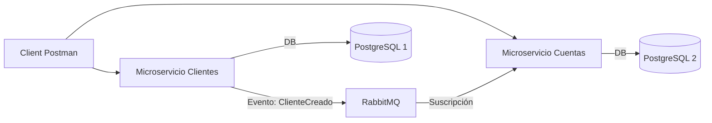

# Spec: Arquitectura de Microservicios, Comunicación Asincrónica y Docker

> **Estado:** `DRAFT` → aprobar con `status: APPROVED` antes de iniciar implementación.

---

## 1. REQUERIMIENTOS

### Descripción
Configurar la arquitectura de microservicios distribuida. Se deben separar las responsabilidades en dos servicios independientes comunicados de forma asincrónica mediante RabbitMQ. Todo el ecosistema debe ser desplegable mediante Docker Compose.

### Requerimiento de Negocio
- **SemiSenior**: Separar en 2 microservicios:
    1. `Cliente/Persona`
    2. `Cuenta/Movimientos`
- **Comunicación**: Asincrónica entre los 2 servicios.
- **RabbitMQ**: Intermediario de mensajes.
- **Docker (F7)**: Despliegue en contenedores.

### Historias de Usuario

#### HU-05: Desacoplamiento de Servicios
```
Como:        Arquitecto de Software
Quiero:      Desacoplar la gestión de clientes de la gestión de cuentas
Para:        Escalar cada servicio de forma independiente y asegurar resiliencia

Prioridad:   Alta
Estimación:  XL
Dependencias: SPEC-001, SPEC-002
Capa:        Infraestructura
```

### Reglas de Negocio
1. **Consistencia Eventual**: Cuando un cliente se crea o actualiza, se debe notificar al servicio de cuentas si es necesario (ej. para caché de nombres).
2. **Resiliencia**: Si el servicio de clientes está caído, el servicio de cuentas debe poder operar con la información que ya posee.

---

## 2. DISEÑO

### Arquitectura



### Configuración RabbitMQ

#### Queues / Exchanges
- **Exchange**: `customer.exchange` (Topic)
- **Queue**: `customer.created.queue`
- **Routing Key**: `customer.created`

### Diseño de Infraestructura (Docker)

#### Docker Compose Services
1. `rabbitmq`: Imagen oficial `rabbitmq:3-management`.
2. `db-clientes`: PostgreSQL para Microservicio 1.
3. `db-cuentas`: PostgreSQL para Microservicio 2.
4. `ms-clientes`: Aplicación Spring Boot 1.
5. `ms-cuentas`: Aplicación Spring Boot 2.

---

## 3. LISTA DE TAREAS

### Infraestructura

#### Implementación RabbitMQ
- [ ] Configurar `RabbitTemplate` en Microservicio 1.
- [ ] Implementar `MessagePublisher` para eventos de cliente.
- [ ] Configurar `RabbitListener` en Microservicio 2.
- [ ] Implementar `MessageConsumer` para procesar eventos y sincronizar datos necesarios.

#### Dockerización (F7)
- [ ] Crear `Dockerfile` para Microservicio 1.
- [ ] Crear `Dockerfile` para Microservicio 2.
- [ ] Crear `docker-compose.yml` que orqueste:
    - 2 DBs PostgreSQL.
    - 1 RabbitMQ.
    - 2 Apps Spring Boot.

### QA
- [ ] Verificar comunicación: Crear cliente y validar que el evento llegue a RabbitMQ.
- [ ] Ejecutar `docker-compose up` y validar que todo el sistema inicie correctamente.
- [ ] Probar endpoints a través de los puertos expuestos en Docker.
